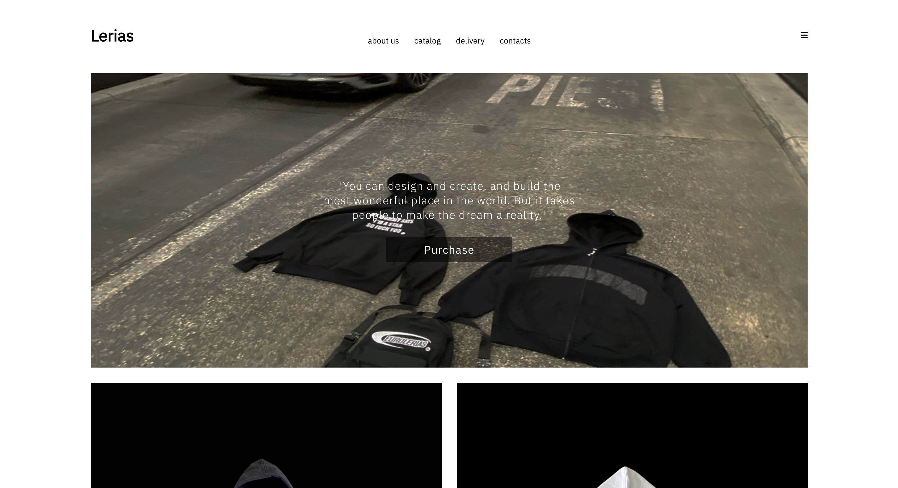

# Warsaw Clothing — React Landing Site

A simple, responsive React landing site for a Warsaw-based clothing brand. This repository contains the front-end landing page used to showcase collections, brand story, and contact information.

## Features
- Modern, responsive landing layout
- Hero section, featured collections, and newsletter sign-up
- Minimal animations and accessible semantics
- Easy to customize styles and content

## Preview

- Preview
  

## Tech stack
- React

## Quick start
1. Clone the repo
2. Install dependencies
  ```
  npm install
  ```
3. Run locally
  ```
  npm start
  ```
4. Build for production
  ```
  npm run build
  ```

## Project structure (example)
- src/
  - components/ — UI blocks (Hero, CollectionCard, Footer)
  - pages/ — Landing page
  - assets/ — images and fonts
  - styles/ — global and component styles
- public/ — static files


## Contributing
Small fixes and improvements welcome. Open a PR with a clear description of changes.

## License
MIT